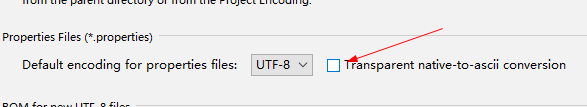

# 第2章 SpringBoot 程序开发

## 2.1 建立统一的pom管理


### 1. 选中文件夹，右键选使用IDEA打开

 

### 2. 设置项目的Maven参数

* 父pom.xml

  ```xml
  <project xmlns="http://maven.apache.org/POM/4.0.0" xmlns:xsi="http://www.w3.org/2001/XMLSchema-instance"
           xsi:schemaLocation="http://maven.apache.org/POM/4.0.0 http://maven.apache.org/xsd/maven-4.0.0.xsd">
      <modelVersion>4.0.0</modelVersion>
  
      <groupId>cn.mldn</groupId>
      <artifactId>mldnboot</artifactId>
      <version>0.0.1</version>
      <packaging>pom</packaging>                    <!-- 定义为pom类型 -->
  
      <name>mldnboot</name>
      <url>https://maven.apache.org</url>
  
      <properties>
          <jdk.version>1.8</jdk.version>
          <spring-boot-dependencies.version>1.5.9.RELEASE</spring-boot-dependencies.version>
          <project.build.sourceEncoding>UTF-8</project.build.sourceEncoding>
          <project.reporting.outputEncoding>UTF-8</project.reporting.outputEncoding>
          <maven.compiler.encoding>UTF-8</maven.compiler.encoding>
      </properties>
  
      <dependencyManagement>
          <dependencies>
              <dependency>            <!-- 定义SpringBoot依赖管理 -->
                  <groupId>org.springframework.boot</groupId>
                  <artifactId>spring-boot-dependencies</artifactId>
                  <version>${spring-boot-dependencies.version}</version>
                  <type>pom</type>
                  <scope>import</scope>
              </dependency>
          </dependencies>
      </dependencyManagement>
      <modules>
          <module>mldnboot-base</module>
      </modules>
      <build>
          <finalName>mldnboot</finalName>
          <plugins>
              <plugin>                                    <!-- 配置编译插件 -->
                  <groupId>org.apache.maven.plugins</groupId>
                  <artifactId>maven-compiler-plugin</artifactId>
                  <version>3.10.1</version>
                  <configuration>
                      <source>${jdk.version}</source>        <!-- 源代码使用的开发版本 -->
                      <target>${jdk.version}</target>        <!-- 需要生成的目标class文件的编译版本 -->
                      <encoding>${maven.compiler.encoding}</encoding>
                  </configuration>
              </plugin>
          </plugins>
      </build>
  </project>
  ```

   

* 子pom.xml

  ```xml
  <?xml version="1.0"?>
  <project
          xsi:schemaLocation="http://maven.apache.org/POM/4.0.0 http://maven.apache.org/xsd/maven-4.0.0.xsd"
          xmlns="http://maven.apache.org/POM/4.0.0" xmlns:xsi="http://www.w3.org/2001/XMLSchema-instance">
      <modelVersion>4.0.0</modelVersion>
      <parent>
          <groupId>cn.mldn</groupId>
          <artifactId>mldnboot</artifactId>
          <version>0.0.1</version>
      </parent>
      <artifactId>mldnboot-base</artifactId>
      <name>mldnboot-base</name>
      <url>https://maven.apache.org</url>
      <properties>
          <project.build.sourceEncoding>UTF-8</project.build.sourceEncoding>
      </properties>
      <dependencies>
          <dependency>
              <groupId>org.springframework.boot</groupId>
              <artifactId>spring-boot-starter-web</artifactId>
          </dependency>
      </dependencies>
  </project>
  ```

   

### 3. 分别执行Maven命令：clean和install

 

### 4. 父项目执行install后，子模块的也编译了


### 5. 运行Controller

默认端口为  8080


### 6. 访问应用

```
http://localhost:8080/
```

 


## 2.2 SpringBoot程序测试

### 1. pom文件新增依赖

```xml
<dependency>
    <groupId>junit</groupId>
    <artifactId>junit</artifactId>
    <scope>test</scope>
</dependency>
<dependency>
    <groupId>org.springframework.boot</groupId>
    <artifactId>spring-boot-starter-test</artifactId>
    <scope>test</scope>
</dependency>
```

### 2. 测试类

```java
package cn.mldn.mldnboot.test;

import org.junit.Test;
import org.junit.runner.RunWith;
import org.springframework.beans.factory.annotation.Autowired;
import org.springframework.boot.test.context.SpringBootTest;
import org.springframework.test.context.junit4.SpringJUnit4ClassRunner;
import org.springframework.test.context.web.WebAppConfiguration;

import cn.mldn.mldnboot.SampleController;
import junit.framework.TestCase;

@SpringBootTest(classes = SampleController.class)	// 定义要测试的SpringBoot类
@RunWith(SpringJUnit4ClassRunner.class)				// 使用Junit进行测试
@WebAppConfiguration								// 进行Web应用配置
public class TestSampleController {
	@Autowired
	private SampleController sampleController;		// 注入控制器对象

	@Test
	public void testHome() {						// 使用junit测试
		TestCase.assertEquals(this.sampleController.home(), "www.mldn.cn");
	}
}
```

### 3. 测试结果

 


### 2.3 SpringBoot注解分析

 


### 2.4  配置访问路径

```java
@RequestMapping("/")                // 访问映射路径
@ResponseBody                        // rest返回形式
public String home() {                // 控制器方法
    return "www.mldn.cn";            // 返回信息
}

@GetMapping("/echo")				// 只支持GET请求模式
@ResponseBody                        // rest返回形式
public String echo(String msg) {	// 接收msg参数
    return "【ECHO】" + msg ;		// 信息处理后返回
}

@GetMapping("/echo2/{message}")				// 只支持GET请求模式
@ResponseBody                        // rest返回形式
public String echo2(@PathVariable("message") String msg) {	// 接收msg参数
    return "【ECHO2】" + msg ;		// 信息处理后返回
}
```


```
http://localhost:8080/

http://localhost:8080/echo?msg=www.mldn.cn

http://localhost:8080/echo2/www.mldn.cn
```


 

 

 

### 2.6 使用内置对象

```java
@GetMapping("/object")
@ResponseBody                        // rest返回形式
public Object object(HttpServletRequest request, HttpServletResponse response) {
    Map<String,String> map = new HashMap<String,String>() ;
    map.put("客户端IP地址", request.getRemoteAddr()) ;
    map.put("客户端响应编码", response.getCharacterEncoding()) ;
    map.put("SessionID", request.getSession().getId()) ;
    map.put("项目真实路径", request.getServletContext().getRealPath("/")) ;
    return map ; 					// 以Restful风格返回
}
```


 


```java
@GetMapping("/object2")
@ResponseBody                        // rest返回形式
public Object object2() {
    HttpServletRequest request = ((ServletRequestAttributes) RequestContextHolder.getRequestAttributes()).getRequest();
    HttpServletResponse response = ((ServletRequestAttributes) RequestContextHolder.getRequestAttributes()).getResponse();
    Map<String, String> map = new HashMap<>();
    map.put("客户端响应编码", response.getCharacterEncoding());
    map.put("客户端IP地址", request.getRemoteAddr());
    map.put("SessionID", request.getSession().getId());
    map.put("项目真实路径", request.getServletContext().getRealPath("/"));
    return map;                    // 以Restful风格返回
}
```

 


### 2.7 使用Jetty容器

* 在pom设置依赖

```xml
<dependency>
    <groupId>org.springframework.boot</groupId>
    <artifactId>spring-boot-starter-web</artifactId>
    <!-- 使用Jetty，需要在spring-boot-starter-web排除spring-boot-starter-tomcat，因为SpringBoot默认使用tomcat -->
    <exclusions>
        <exclusion>
            <groupId>org.springframework.boot</groupId>
            <artifactId>spring-boot-starter-tomcat</artifactId>
        </exclusion>
    </exclusions>
</dependency>

<dependency>
    <groupId>org.springframework.boot</groupId>
    <artifactId>spring-boot-starter-jetty</artifactId>
</dependency>
```

* 运行结果

 

 

 

### 2.8 配置环境属性

 

```properties
# 设置Tomcat的运行服务所在端口
server.port=80
# 可以配置ContextPath访问路径，但是在实际开发之中是不能够进行配置的
server.context-path=/mldnjava
```


[IDEA 中.properties文件中文自动转Unicode编码及乱码问题](https://www.cnblogs.com/Jimc/p/10167653.html)

问题描述： 在使用IDEA开发工具编辑属性文件（.properties）的时候出现中文自动转成了Unicode编码，或在读取属性文件的时候中文出现乱码。  


问题解决： 进入 File -> Settings -> Editor -> File Encodings，勾选 Transparent native-to-ascii conversion 选项。  


再次查看属性文件，可以发现已经恢复正常了，并且读取属性也不会出现乱码的问题了。 


# END
