## 第3章 Thymeleaf模板渲染 

### 3.1 Thymeleaf简介 

### 3.2 Thymeleaf编程起步 

#### 样例01

```java
@GetMapping("/view1")
public String view1(String mid, Model model) {
    model.addAttribute("url", "www.mldn.cn"); 	// request属性传递包装
    model.addAttribute("mid", mid); 			// request属性传递包装
    return "message/01_message_show"; 				// 此处只返回一个路径， 该路径没有设置后缀，后缀默认是*.html
}
```


http://localhost:8086/view1?mid=mldnjava

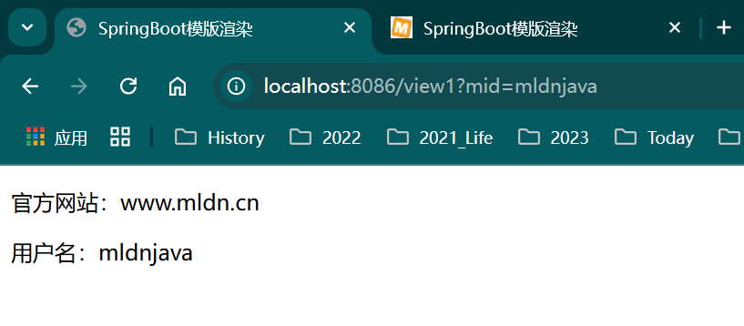

#### 样例02 html样式

```java
@GetMapping("/view2")
public String view2(String mid, Model model) {
    model.addAttribute("url", "<h1><span style='color:red'>www.mldn.cn</span></h1>");// request属性传递包装
    model.addAttribute("mid", mid); 			// request属性传递包装
    return "message/02_message_show"; 				// 此处只返回一个路径， 该路径没有设置后缀，后缀默认是*.html
}
```

http://localhost:8086/view2?mid=mldnjava

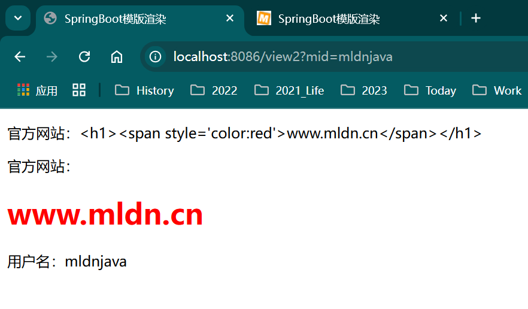

### 3.3 Thyemeleaf静态资源

#### 样例03 静态资源

直接访问路径下的html文件

 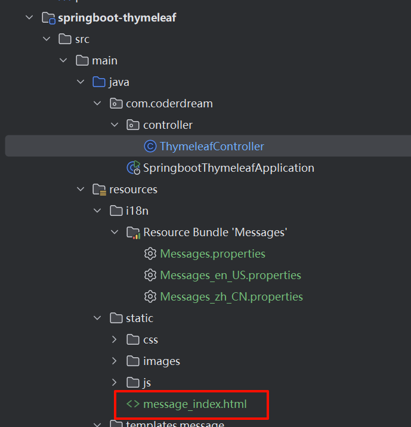

* message_index.html

```html
<!DOCTYPE HTML>
<html xmlns:th="http://www.thymeleaf.org">    <!-- 引入命名空间 -->
<head>
  <title>SpringBoot模版渲染</title>
  <meta http-equiv="Content-Type" content="text/html;charset=UTF-8"/>
  <link rel="icon" type="image/x-icon" href="/images/mldn.ico"/>
  <link rel="stylesheet" type="text/css" href="/css/style.css">
  <script type="text/javascript" src="/js/message_index.js"></script>
</head>
<body>
<div></div>
<div class="message">魔乐科技：www.mldn.cn</div>
</body>
</html>
```

* message_index.js

```js
window.onload = function() {
	console.log("魔乐科技软件训练营：www.mldnjava.cn") ;
}
```

访问路径：http://localhost:8086/message_index.html

效果：展示页面，控制台显示日志

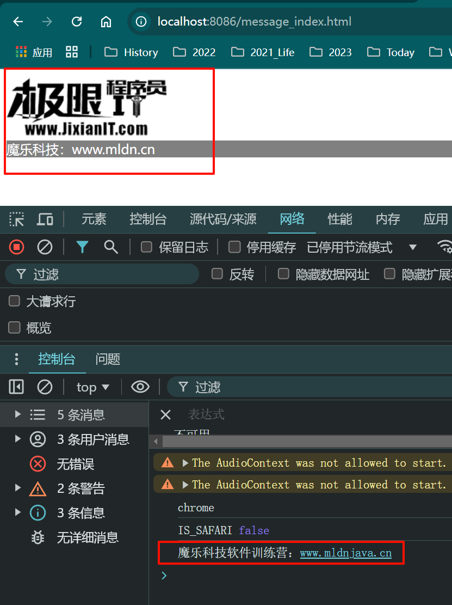

### 3.4 读取资源文件

* ThymeleafController.java

```java
/**
	 * 3.4 读取资源文件
	 * @return	返回视图路径
	 */
@GetMapping("/view4")
public String view4(String mid, Model model) {
    return "message/04_message_value"; 				// 此处只返回一个路径， 该路径没有设置后缀，后缀默认是*.html
}
```

* 04_message_value.html

```html
<!DOCTYPE HTML>
<html xmlns:th="http://www.thymeleaf.org">	<!-- 引入命名空间 -->
<head>
	<title>SpringBoot模版渲染</title>
	<meta http-equiv="Content-Type" content="text/html;charset=UTF-8"/>
	<link rel="icon" type="image/x-icon" href="/images/mldn.ico"/>
</head>
<body>
	<h2 th:text="#{welcome.url}"/>			<!-- 读取资源文件 -->
	<h2 th:text="#{welcome.msg('李兴华')}"/>	<!-- 读取资源文件 -->
</body>
</html>
```

* Messages.properties

```properties
welcome.url=www.mldn.cn
welcome.msg=欢迎{0}光临！
```

访问路径：http://localhost:8086/view4

 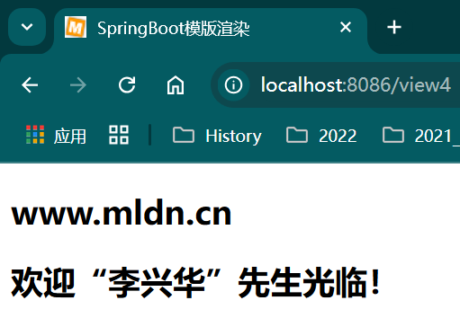

### 3.5 路径处理

* ThymeleafController.java

```java
/**
     * 3.5 路径处理 
     * @return	返回视图路径
     */
@GetMapping("/view5")
public String path() {
    return "message/05_message_path";
}
```

* 05_message_path.html  路径中使用 @{} 

```html
<!DOCTYPE HTML>
<html xmlns:th="http://www.thymeleaf.org">		<!-- 引入命名空间 -->
<head>
	<title>SpringBoot模版渲染</title>
	<meta http-equiv="Content-Type" content="text/html;charset=UTF-8"/>
	<link rel="icon" type="image/x-icon" th:href="@{/images/mldn.ico}"/>
	<link rel="stylesheet" type="text/css" th:href="@{/css/style.css}"/>
	<script type="text/javascript" th:src="@{/js/message_index.js}"></script>
</head>
<body>
	<div></div>
	<div class="message">魔乐科技：www.mldn.cn</div>
</body>
</html>
```

访问路径：http://localhost:8086/view5

 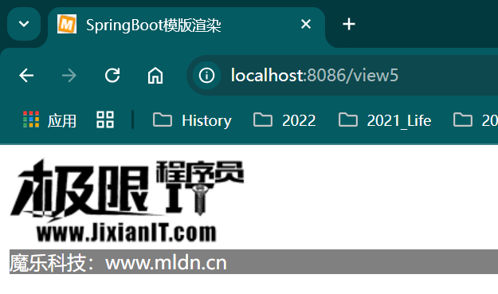

### 3.6 内置对象操作支持

* ThymeleafController.java

```java
/**
 * 3.6 获取内置对象
 * @return 返回视图路径
 */
@GetMapping("/demo06")
public String attr() {
	HttpServletRequest request = ((ServletRequestAttributes) RequestContextHolder.getRequestAttributes())
		.getRequest();            // 获取HttpServletRequest内置对象
	request.setAttribute("requestMessage", "request - www.mldn.cn");
	request.getSession()
		.setAttribute("sessionMessage", "session - www.mldnjava.cn");
	request.getServletContext().setAttribute("applicationMessage",
		"application - www.jixianit.com");
	return "message/06_message_attr";
}
```

* 06_message_attr.html

```html
<!DOCTYPE HTML>
<html xmlns:th="http://www.thymeleaf.org">	<!-- 引入命名空间 -->
<head>
	<title>SpringBoot模版渲染</title>
	<meta http-equiv="Content-Type" content="text/html;charset=UTF-8"/>
	<link rel="icon" type="image/x-icon" href="/images/mldn.ico"/>
</head>
<body>
	<p th:text="'requestMessage = ' + ${requestMessage}"/>
	<p th:text="'sessionMessage = ' + ${session.sessionMessage}"/>
	<p th:text="'applicationMessage = ' + ${application.applicationMessage}"/>
	<hr/>
	<p th:text="${#httpServletRequest.getRemoteAddr()}"/>
	<p th:text="${#httpServletRequest.getAttribute('requestMessage')}"/>
	<p th:text="${#httpSession.getId()}"/>
	<p th:text="${#httpServletRequest.getServletContext().getRealPath('/')}"/>
</body>
</html>
```

访问地址：http://localhost:8086/demo06

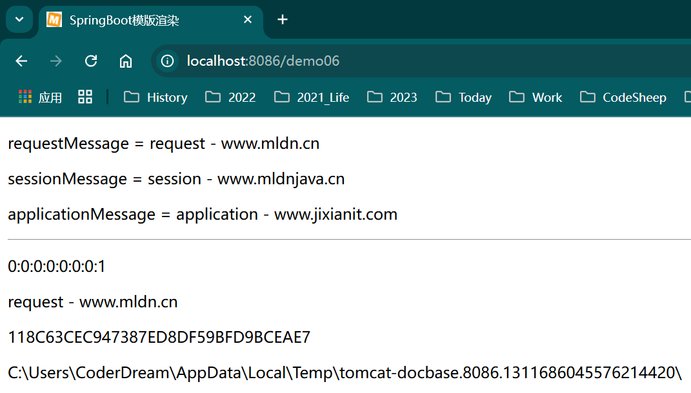

### 3.7 对象输出

* ThymeleafController.java

```java
/**
 * 3.7 对象输出
 *
 * @return 返回视图路径
 */
@GetMapping("/demo07")
public String member(Model model) throws Exception {
    Member vo = new Member();
    vo.setMid("mldnjava");
    vo.setName("李兴华");
    vo.setSalary(3500.00);
    vo.setAge(18);
    vo.setBirthday(new SimpleDateFormat("yyyy-MM-dd").parse("1998-09-15"));
    model.addAttribute("member", vo);        // 传递页面属性
    return "message/07_message_member";
}
```

* 07_message_member.html

```html
<!DOCTYPE HTML>
<html xmlns:th="http://www.thymeleaf.org">  <!-- 引入命名空间 -->
<head>
  <title>SpringBoot模版渲染</title>
  <meta http-equiv="Content-Type" content="text/html;charset=UTF-8"/>
  <link rel="icon" type="image/x-icon" href="/images/mldn.ico"/>
</head>
<body>
<p th:text="'用户编号：' + ${member.mid}"/>
<p th:text="'用户姓名：' + ${member.name}"/>
<p th:text="'用户年龄：' + ${member.age}"/>
<p th:text="'用户工资：' + ${member.salary}"/>
<p th:text="'出生日期：' + ${member.birthday}"/>
<hr>
<div th:object="${member}">
  <p th:text="'用户编号：' + *{mid}"/>
  <p th:text="'用户姓名：' + *{name}"/>
  <p th:text="'用户年龄：' + *{age}"/>
  <p th:text="'用户工资：' + *{salary}"/>
  <p th:text="'出生日期：' + *{birthday}"/>
</div>
</body>
</html>
```

* 访问路径：http://localhost:8086/demo07

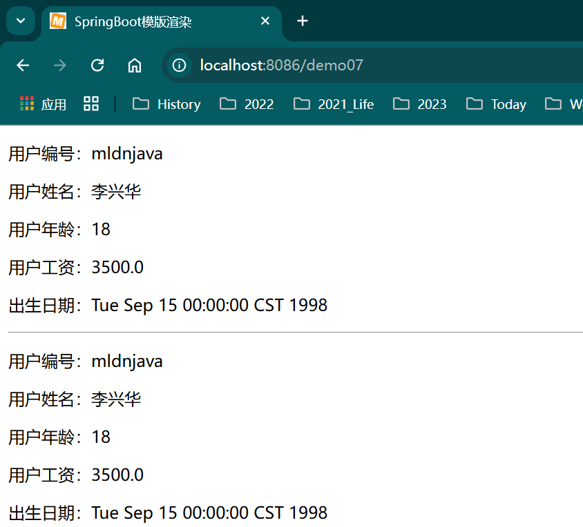

### 3.8 页面逻辑处理

* ThymeleafController.java

```java
/**
 * 3.8 页面逻辑处理
 *
 * @return 返回视图路径
 */
@GetMapping("/demo08")
public String member2(Model model) throws Exception {
    return "message/08_message_member";
}
```

* 08_message_member.html

```html
<!DOCTYPE HTML>
<html xmlns:th="http://www.thymeleaf.org">  <!-- 引入命名空间 -->
<head>
  <title>SpringBoot模版渲染</title>
  <meta http-equiv="Content-Type" content="text/html;charset=UTF-8"/>
  <link rel="icon" type="image/x-icon" href="/images/mldn.ico"/>
</head>
<body>
<div th:object="${member}">
  <p th:if="*{age ge 18}">
    成年人应该为了梦想而努力！
  </p>
  <p th:unless="*{age ge 18}">
    未成年人应该好好学习基础文化课程，好好锻炼身体！
  </p>
  <p th:if="*{name eq '李兴华'}">
    欢迎李老师来访，鼓掌~
  </p>
  <hr/>
  <div th:object="${member}">
    <p th:switch="*{mid}">
      <span th:case="mldnjava">欢迎“mldnjava”用户访问</span>
      <span th:case="jixianit">欢迎“jixianit”用户访问</span>
      <span th:case="*">没有匹配成功的数据，别匹配了！</span>
    </p>
  </div>
</div>
</body>
</html>
```

* 访问地址：http://localhost:8086/demo08

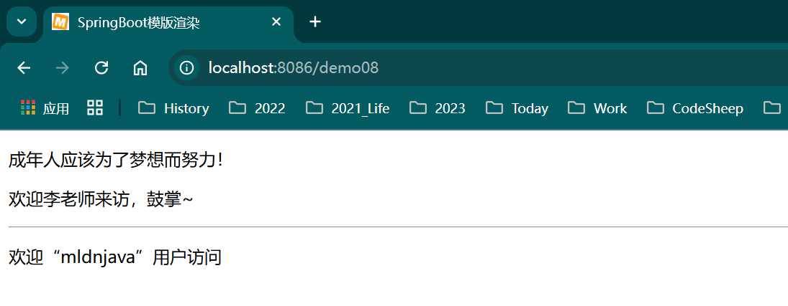

### 3.9 数据迭代处理

* ThymeleafController.java

```java
/**
 * 3.9 输出List
 *
 * @return 返回视图路径
 */
@GetMapping("/demo09")
public String list(Model model) throws Exception {
    List<Member> allMembers = new ArrayList<Member>();
    for (int x = 0; x < 5; x++) {
        Member vo = new Member();
        vo.setMid("mldnjava - " + x);
        vo.setName("李兴华 - " + x);
        vo.setSalary(3500.00);
        vo.setAge(16 + x);
        vo.setBirthday(
            new SimpleDateFormat("yyyy-MM-dd").parse("1998-09-15"));
        allMembers.add(vo);
    }
    model.addAttribute("allMembers", allMembers);        // 传递页面属性
    return "message/09_message_list";
}
```

* 09_message_list.html

```html
<!DOCTYPE HTML>
<html xmlns:th="http://www.thymeleaf.org">	<!-- 引入命名空间 -->
<head>
	<title>SpringBoot模版渲染</title>
	<meta http-equiv="Content-Type" content="text/html;charset=UTF-8"/>
	<link rel="icon" type="image/x-icon" href="/images/mldn.ico"/>
</head>
<body> 
	<table border="1">
		<tr><td>No.</td><td>编号</td><td>姓名</td><td>年龄</td><td>工资</td><td>生日</td></tr>
		<tr th:each="member,memberStat:${allMembers}">
			<td th:text="${memberStat.index + 1}"/>
			<td th:text="${member.mid}"/>
			<td th:text="${member.name}"/>
			<td th:text="${member.age}"/>
			<td th:text="${member.salary}"/>
			<td th:text="${member.birthday}"/>
		</tr>
	</table>
</body>
</html> 
```

* 访问地址：http://localhost:8086/demo09

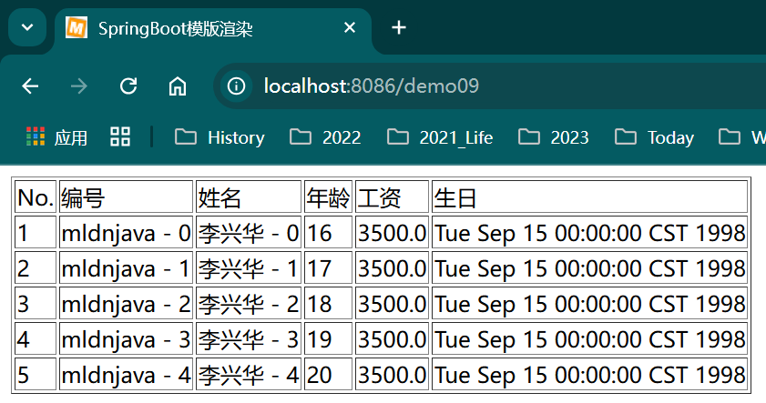

* ThymeleafController.java

```java
/**
 * 3.10 输出Map
 *
 * @param model
 * @return
 * @throws Exception
 */
@GetMapping("/demo10")
public String map(Model model) throws Exception {
    Map<String, Member> allMembers = new HashMap<String, Member>();
    for (int x = 0; x < 5; x++) {
        Member vo = new Member();
        vo.setMid("mldnjava - " + x);
        vo.setName("李兴华 - " + x);
        vo.setSalary(3500.00);
        vo.setAge(16 + x);
        vo.setBirthday(
            new SimpleDateFormat("yyyy-MM-dd").parse("1998-09-15"));
        allMembers.put("mldn-" + x, vo);
    }
    model.addAttribute("allMembers", allMembers);        // 传递页面属性
    return "message/10_message_map";
}
```

* 10_message_map.html

```html
<!DOCTYPE HTML>
<html xmlns:th="http://www.thymeleaf.org">	<!-- 引入命名空间 -->
<head>
	<title>SpringBoot模版渲染</title>
	<meta http-equiv="Content-Type" content="text/html;charset=UTF-8"/>
	<link rel="icon" type="image/x-icon" href="/images/mldn.ico"/>
</head>
<body> 
	<table border="1">
		<tr><td>No.</td><td>key</td><td>编号</td><td>姓名</td><td>年龄</td><td>工资</td><td>生日</td></tr>
		<tr th:each="memberEntry,memberStat:${allMembers}">
			<td th:text="${memberStat.index + 1}"/>
			<td th:text="${memberEntry.key}"/>
			<td th:text="${memberEntry.value.mid}"/>
			<td th:text="${memberEntry.value.name}"/>
			<td th:text="${memberEntry.value.age}"/>
			<td th:text="${memberEntry.value.salary}"/>
			<td th:text="${memberEntry.value.birthday}"/>
		</tr>
	</table>
</body>
</html> 
```

* 访问地址：http://localhost:8086/demo10

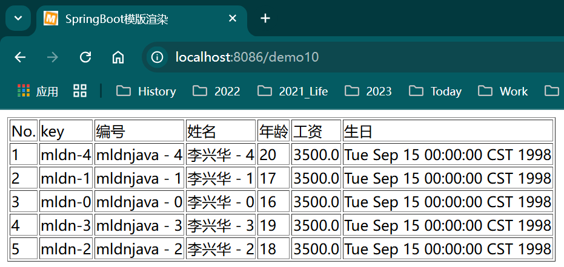

```java
/**
 * 3.10 输出Map
 *
 * @param model
 * @return
 * @throws Exception
 */
@GetMapping("/demo10")
public String map(Model model) throws Exception {
//        Map<String, Member> allMembers = new HashMap<String, Member>();
    Map<String, Member> allMembers = new LinkedHashMap<>();
    for (int x = 0; x < 5; x++) {
        Member vo = new Member();
        vo.setMid("mldnjava - " + x);
        vo.setName("李兴华 - " + x);
        vo.setSalary(3500.00);
        vo.setAge(16 + x);
        vo.setBirthday(
            new SimpleDateFormat("yyyy-MM-dd").parse("1998-09-15"));
        allMembers.put("mldn-" + x, vo);
    }
    model.addAttribute("allMembers", allMembers);        // 传递页面属性
    return "message/10_message_map";
}
```

使用排序Map

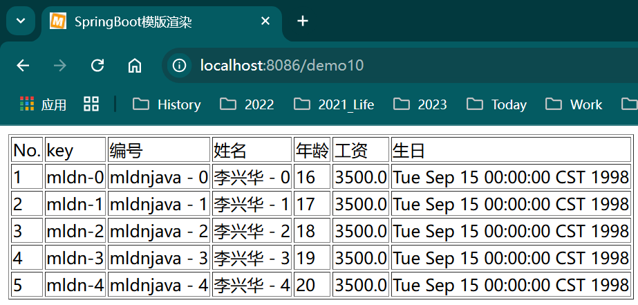

### 3.10 包含指令

* ThymeleafController.java

```java
/**
 * 3.11 页面包含
 * @param model model
 * @return 返回视图路径
 */
@GetMapping("/demo11")
public String include(Model model) throws Exception {
    return "message/11_message_include" ;
}
```

* foot.html

```html
<meta http-equiv="Content-Type" content="text/html;charset=UTF-8"/>
<foot th:fragment="companyInfo">
	<p><span th:text="${title}"/>（<span th:text="${url}"/>）</p>
</foot>
```

* 11_message_include.html

```html
<!DOCTYPE HTML>
<html xmlns:th="http://www.thymeleaf.org">	<!-- 引入命名空间 -->
<head>
	<title>SpringBoot模版渲染</title>
	<meta http-equiv="Content-Type" content="text/html;charset=UTF-8"/>
	<link rel="icon" type="image/x-icon" href="/images/mldn.ico"/>
</head>
<body>
	<div th:include="@{/commons/foot} :: companyInfo" th:with="title=魔乐科技,url=www.mldn.cn"/>
</body>
</html> 
```

本程序使用th:include指令（替换掉父元素\<div\>）实现了页面的包含处理，同时利用th:with命令向被包含页面传递了两个参数。此时的页面运行效果如图3-15所示。  

* 访问地址：http://localhost:8086/demo11

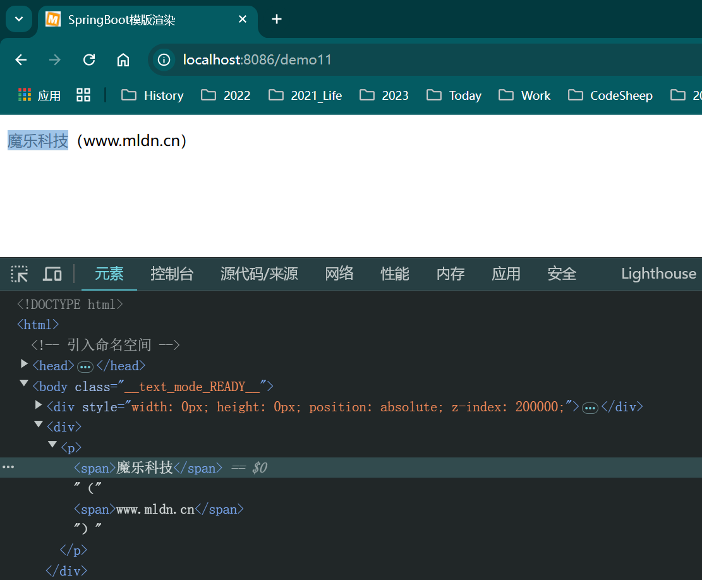

### 3.11 Thymeleaf数据处理 43

* ThymeleafController.java

```java
/**
 * 3.12 输出Set
 *
 * @param model model
 * @return 返回视图路径
 */
@GetMapping("/demo12")
public String set(Model model) throws Exception {
    Set<String> all = new HashSet<String>();
    all.addAll(Arrays.asList("mldn", "mldnjava", "jixianit"));
    model.addAttribute("allInfos", all);        // 传递页面属性
    return "message/12_message_set";
}
```

* 12_message_set.html

```html
<!DOCTYPE HTML>
<html xmlns:th="http://www.thymeleaf.org">	<!-- 引入命名空间 -->
<head>
	<title>SpringBoot模版渲染</title>
	<meta http-equiv="Content-Type" content="text/html;charset=UTF-8"/>
	<link rel="icon" type="image/x-icon" href="/images/mldn.ico"/>
</head>
<body> 
	<p th:if="${#sets.contains(allInfos,'mldn')}">存在有“mldn”的信息！</p>
	<p th:text="${'集合长度：' + #sets.size(allInfos)}"/>
</body>
</html> 
```

* 访问地址：http://localhost:8086/demo12

 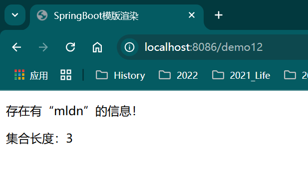

* ThymeleafController.java

```java
/**
 * 3.13 输出字符串
 *
 * @param model model
 * @return 返回视图路径
 * @throws Exception Exception
 */
@GetMapping("/demo13")
public String string(Model model) throws Exception {
    model.addAttribute("info", "www.mldn.cn");
    return "message/13_message_string";
}
```

* 13_message_string.html

```html
<!DOCTYPE HTML>
<html xmlns:th="http://www.thymeleaf.org">		<!-- 引入命名空间 -->
<head>
	<title>SpringBoot模版渲染</title>
	<meta http-equiv="Content-Type" content="text/html;charset=UTF-8"/>
</head>
<body>
	<p th:text="${'字符串替换：' + #strings.replace('www.mldn.cn','mldn.cn','jixianit.com')}"/>
	<p th:text="${'字符串转大写：' + #strings.toUpperCase('www.mldn.cn')}"/>
	<p th:text="${'字符串截取：' + #strings.substring(info,4)}"/>
</body>
</html>
```

* 访问地址：http://localhost:8086/demo13

 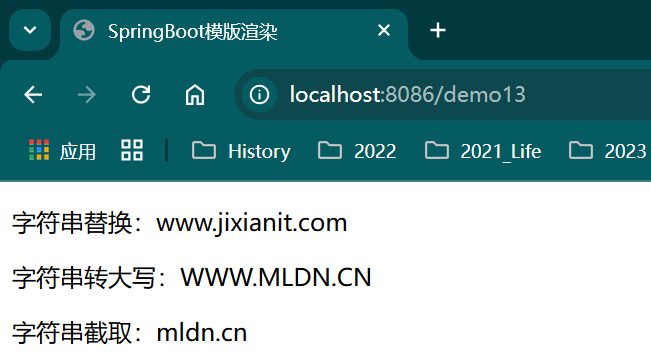

* ThymeleafController.java

```java
/**
 * 3.14 输出日期
 *
 * @param model model
 * @return 返回视图路径
 * @throws Exception Exception
 */
@GetMapping("/demo14")
public String date(Model model) throws Exception {
    model.addAttribute("mydate",
        new SimpleDateFormat("yyyy-MM-dd HH:mm:ss").parse(
            "2008-08-08 18:08:08"));
    return "message/14_message_date";
}
```

* 14_message_date.html

```html
<!DOCTYPE HTML>
<html xmlns:th="http://www.thymeleaf.org">		<!-- 引入命名空间 -->
<head>
	<title>SpringBoot模版渲染</title>
	<meta http-equiv="Content-Type" content="text/html;charset=UTF-8"/>
</head>
<body>
	<p th:text="${#dates.format(mydate,'yyyy-MM-dd')}"/>
	<p th:text="${#dates.format(mydate,'yyyy-MM-dd HH:mm:ss.SSS')}"/>
</body>
</html>
```

* 访问地址：http://localhost:8086/demo14

 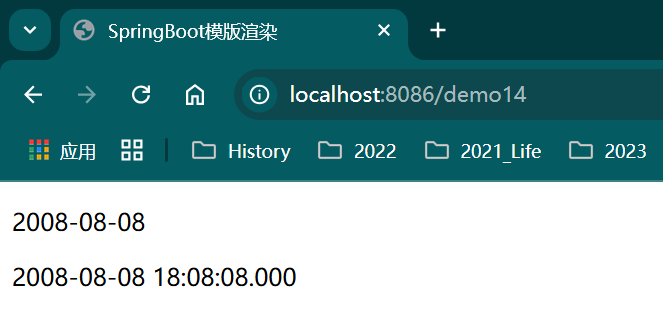

### 3.12 本章小结 45